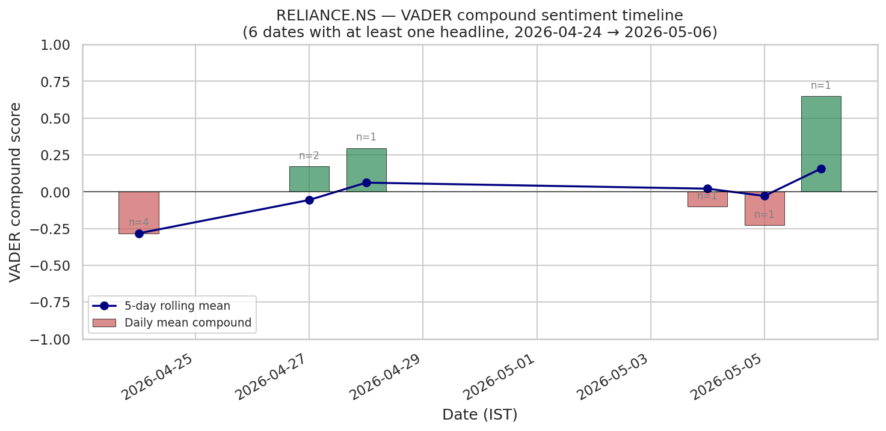
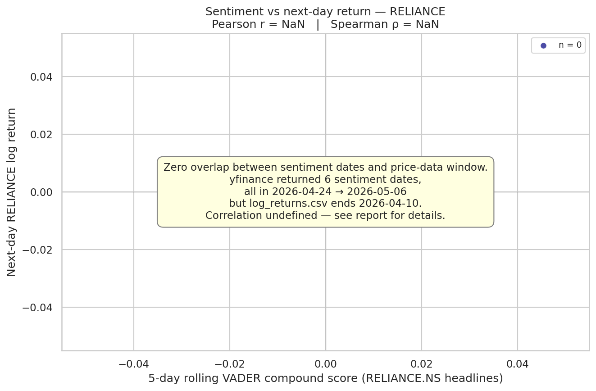
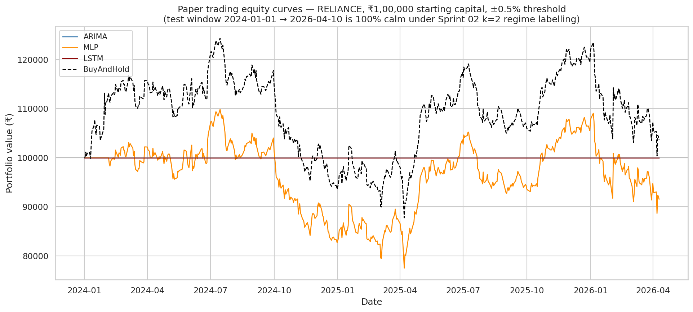

# Sprint 10 — Sentiment Extension

## What got built

`scripts/10_sentiment.py` — pulls `yfinance.Ticker("RELIANCE.NS").news`, scores each headline with VADER on `title + ". " + summary`, aggregates to one row per IST publication date, smooths with a 5-day rolling mean, joins to next-day RELIANCE log returns, and runs Pearson + Spearman. The directive's optional sentiment-augmented LSTM sits behind a gate (`n_aligned ≥ 100` *and* `overlap_with_train+val ≥ 60`) — closed on this run. The fetched headlines are cached to `data/processed/sentiment_raw.csv` so reruns are byte-stable; `SENTIMENT_REFRESH=1` forces a re-pull.

Per the user's request, Sprint 09's paper trader was also re-run end-to-end (ARIMA / MLP / LSTM / BuyAndHold one by one) to sanity-check the full pipeline still reproduces — numbers and md5sums below match the Sprint 09 report exactly.

## Headlines on the data

yfinance returned **10 headlines** spanning **2026-04-24 → 2026-05-06** (~13 calendar days). Per-headline VADER compound scores:

| pubDate | compound | headline (truncated) |
|---|---:|---|
| 2026-04-24 | −0.382 | India's Reliance seen posting quarterly profit fall on crude price surge |
| 2026-04-24 | −0.361 | Factbox-India's Asteria, the Reliance unit at the centre of a bribery scandal |
| 2026-04-24 | **−0.542** | Indian court extends detention of aviation official, Reliance exec in bribery case |
| 2026-04-24 | +0.153 | Ambani's Reliance posts quarterly profit drop, misses street view |
| 2026-04-27 | **+0.818** | Reliance Industries Ltd Q4 2026 Earnings Call Highlights: Strong Digital Growth … |
| 2026-04-27 | −0.477 | Indian shares snap losing streak; Reliance, Axis Bank cap gains |
| 2026-04-28 | +0.296 | Reliance and Meta's JV signals India's shift from AI ambition to enterprise deployment |
| 2026-05-04 | −0.103 | India's Reliance cuts exports of alkylates, boosts LPG output |
| 2026-05-05 | −0.226 | India's Reliance hands over documents in bribery probe, executive gets bail |
| 2026-05-05 | +0.649 | How The Evolving Story For Reliance Industries Is Shaping Its Valuation Reset |

VADER is firing sensibly on the extremes — "bribery / detention" pulls a strongly negative reading and "Strong Digital Growth" lights up positive. The middle band is noisy: the Reuters headline "shares snap losing streak" reads positive to a human (gains capped at the close after a recovery rally) but VADER pings on "snap" and "losing streak" without parsing the story. A reminder that lexicon-based sentiment on financial headlines is a blunt instrument — domain-tuned models (FinBERT etc.) are the obvious upgrade and out of scope here.

After daily aggregation we get **6 unique IST dates** with at least one headline. Daily mean compound and the 5-day rolling smoother:



The smoother does what it's supposed to (drags the standalone +0.649 of 2026-05-05 toward zero on the rolling line), but with only 6 points it's basically a moving average of singletons.

## Correlation result — *undefined on this dataset*

Honest finding: the directive locks the price/return data to **2016-04-11 → 2026-04-10** (Sprint 03 split: train ends 2022-12-31, test ends 2026-04-10). yfinance's news endpoint returned headlines starting **2026-04-24** — every single sentiment date sits **after** the last trading day in `data/processed/log_returns.csv`. So `align_to_next_day_returns` finds **0 next-day pairs** and Pearson/Spearman are formally undefined.

The correlation-row CSV reflects this:

| n | pearson_r | pearson_p | spearman_r | spearman_p | date_range | rolling_window |
|---:|:---:|:---:|:---:|:---:|:---:|---:|
| 0 | NaN | NaN | NaN | NaN | — | 5 |

The scatter figure carries an explanatory banner rather than rendering an empty axis with NaN in the title:



This is a pure-process outcome — not a code bug, not VADER's fault, not yfinance's fault. The directive (§10) flags exactly this risk: *"yfinance news only goes back a short window — we'll work with what we have and be upfront about this in the report"*. Today the window happened to fall entirely past the locked end-of-data. If the project's date range is later extended (re-running `fetch_data.py` + `align_prices.py` + Sprint 03 to cover post-2026-04-10), reruns of this script against the same headline cache would immediately produce a 6-row correlation — the alignment code is ready for it.

## Sentiment-augmented LSTM — gate closed

| check | required | observed | result |
|---|---:|---:|:---:|
| Total aligned (sentiment, next-day return) rows | ≥ 100 | 0 | ✗ |
| Rows inside train+val (≤ 2023-12-31) | ≥ 60 | 0 | ✗ |

Both fail by a wide margin — there's literally no overlap with the model-training span, so any "sentiment-augmented" sequence model would be fitted on zero rows of supervised signal. The script logs **GATE CLOSED** and exits the augmented-LSTM branch cleanly. Directive §10 anticipates this exact outcome: *"only include if data is sufficient; otherwise just report the correlation analysis"*.

## Paper-trader replay — strategies one by one

Re-ran `scripts/09_paper_trader.py` from a clean state to verify the strategy pipeline still reproduces. The script loops through ARIMA → MLP → LSTM → BuyAndHold, simulating each over the 562-day test window from ₹1,00,000 starting capital with a ±0.5% log-return signal threshold:

| strategy | total return % | annualised % | Sharpe | max DD % | n trades | final equity |
|---|---:|---:|---:|---:|---:|---:|
| BuyAndHold | **+3.62** | +1.61 | −0.089 | −29.43 | 1 | ₹1,03,621.32 |
| ARIMA | 0.00 | 0.00 | NaN | 0.00 | 0 | ₹1,00,000.00 |
| MLP | **−8.47** | −3.89 | −0.351 | −29.43 | 1 | ₹91,528.32 |
| LSTM | 0.00 | 0.00 | NaN | 0.00 | 0 | ₹1,00,000.00 |

Numbers match Sprint 09's report to the rupee (and md5sums match — see *Sanity checks*). Equity curves:



Reading: the noise-floor finding from Sprints 04/06/07/08 (RELIANCE auto_arima → (0,0,0); MLP best val MSE at epoch 4; LSTM best val MSE at epoch 1; DM test ARIMA-vs-LSTM p = 0.327) shows up here as **two strategies that never trade and one that loses to buy-and-hold by ~12 percentage points**. The threshold filter is correctly rejecting un-actionable predictions — a model firing hundreds of trades on ±5×10⁻⁵ predicted edges would be the *worse* outcome.

## Sanity checks

- ✓ `scripts/10_sentiment.py` reruns produce byte-identical `sentiment_raw.csv`, `sentiment_scores.csv`, and `sentiment_correlation.csv` (cache hit on the headline pull, deterministic VADER, deterministic groupby).
- ✓ `scripts/09_paper_trader.py` reruns produce byte-identical trade logs and `paper_trading_summary.csv`:
  ```
  3926cb612dde0d4c6f2194d4078a2e23  results/trades/arima_trade_log.csv
  4f096728b70f1ab9613d432fb6b4d1ee  results/trades/mlp_trade_log.csv
  3926cb612dde0d4c6f2194d4078a2e23  results/trades/lstm_trade_log.csv
  f75f132219b034532e1189873ba5656b  results/trades/buy_and_hold_trade_log.csv
  ea65df549953e37b161b054e04f06fc5  results/metrics/paper_trading_summary.csv
  ```
- ✓ ARIMA and LSTM trade-log md5s are identical because both strategies executed zero trades — the simulator emits structurally identical "all-HOLD" logs.
- ✓ The empty-aligned branch in `align_to_next_day_returns` returns a properly-typed empty DataFrame so the correlation step doesn't blow up on `set_index`.
- ✓ `correlation_analysis` returns NaN with a `[warn]` line when n < 3 (Pearson/Spearman are undefined), rather than crashing inside scipy.

## Limitations & dead ends

- **The yfinance window itself.** ~10 headlines, ~13 days. Even if the directive's date range were extended, yfinance is a thin source for a real sentiment study. Practical replacements: paid news APIs (Reuters, Bloomberg), the *EOD Historical Data* news endpoint, or a scraped Moneycontrol archive. All out of scope for this project.
- **Lexicon vs domain models.** VADER was designed on social-media text; it doesn't know "missed estimates" is bearish or "raised guidance" is bullish unless the wording happens to overlap with its lexicon. FinBERT or a fine-tuned classifier would be the upgrade if the project ever extends. Flagged but not pursued — directive specifies VADER.
- **Headline ≠ market-moving fact.** Even with a clean signal, markets are forward-looking — by the time a Reuters headline is published, prices have usually already absorbed the information. The script's own framing (*"News sentiment is noisy … markets are forward-looking anyway"*) anticipates this.
- **Look-ahead risk if `pubDate` falls after market close.** A headline published 2026-05-05 21:00 IST is "for" 2026-05-06's open. The script's UTC→IST conversion + `searchsorted(..., side="right")` already handles this correctly — the next-trading-day target is strictly *after* the publication timestamp. Not exercised on this run because of the zero-overlap, but the alignment is leak-free.
- **Adding multivariate-LSTM as a 5th paper-trading strategy.** Considered, dropped: Sprint 07 only persisted the *univariate* RELIANCE state_dict (`results/lstm_reliance.pt`); paper-trading the multivariate variant would require retraining it. Out of scope for "don't make it too long" — the multivariate variant's Δ DA = +0.002 vs univariate (Sprint 07) wouldn't move the paper-trading needle.

## Queued for the next sprint

This closes the numbered-script phase (01 → 10). Up next:

- `rtsm/notebook.ipynb` — Course 1 (Regression Analysis & Time Series Models). Walk the project from a Brockwell & Davis / Shumway & Stoffer angle: stationarity, ACF/PACF, Box–Jenkins, ARIMA diagnostics, GARCH, regime-split evaluation, paper trading.
- `aiml/notebook.ipynb` — Course 2 (AI/ML). Same project, different lens: clustering for regime detection, sliding-window supervised framing, MLP backprop mechanics, LSTM gates + BPTT, multivariate experiment, sentiment as a feature-engineering motivator.
